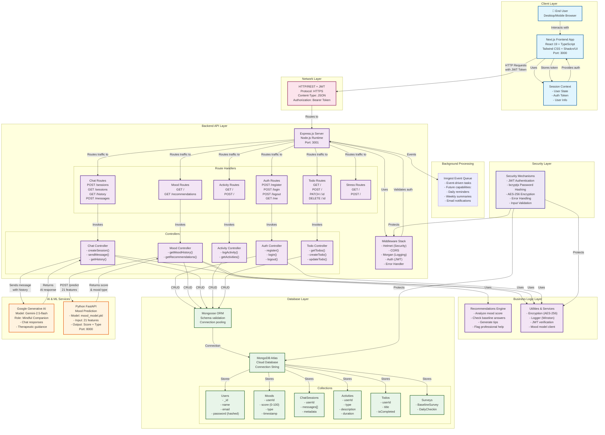
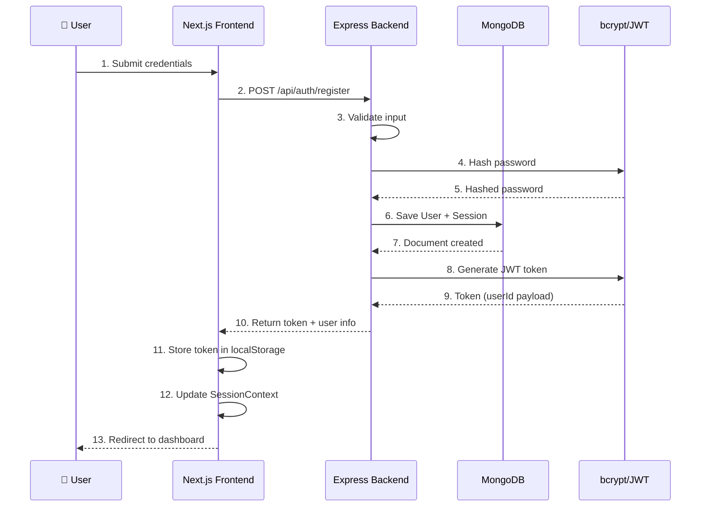
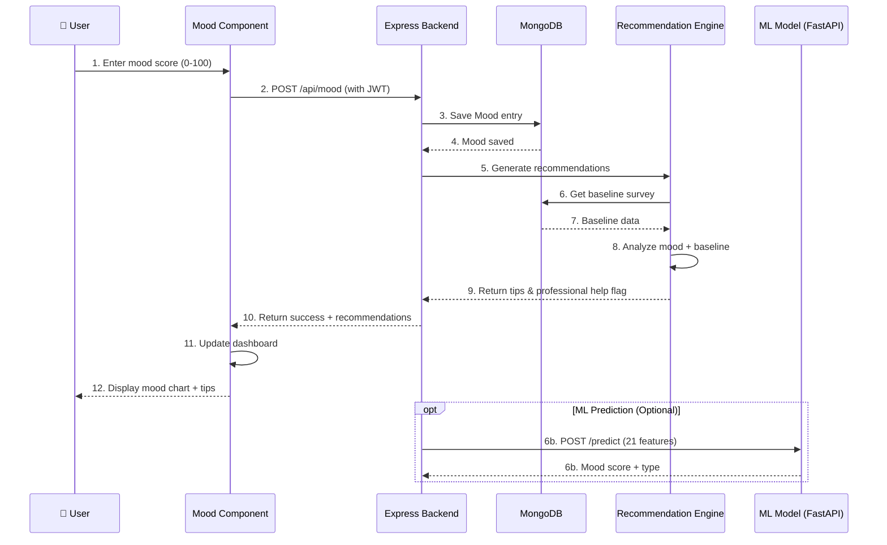
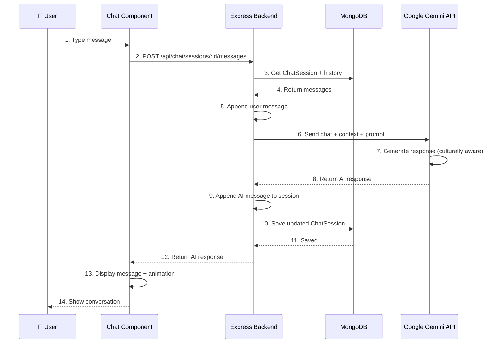
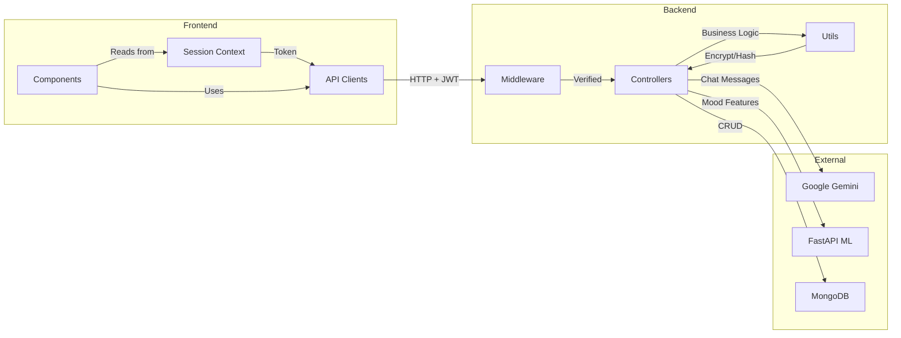
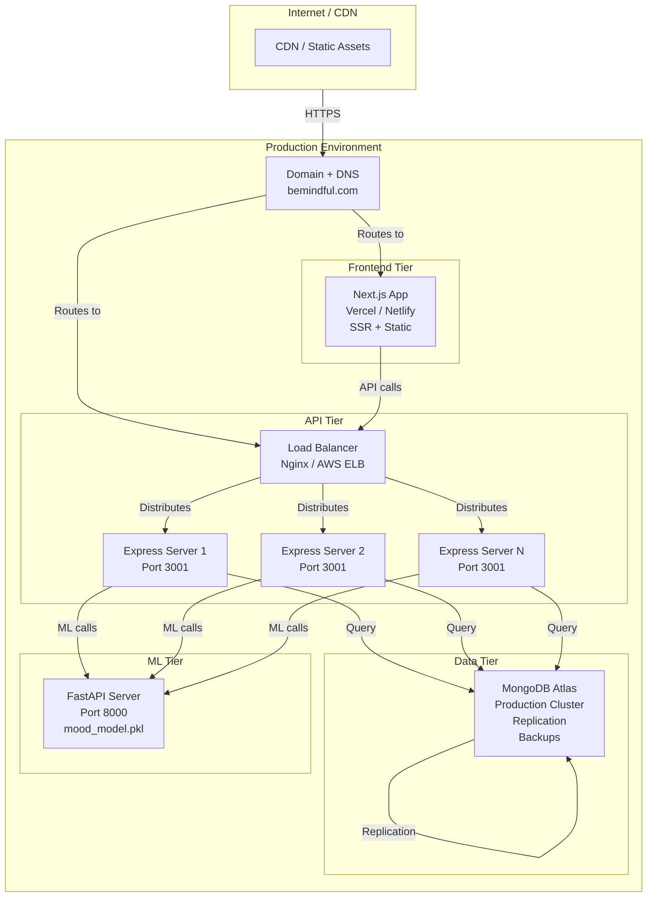
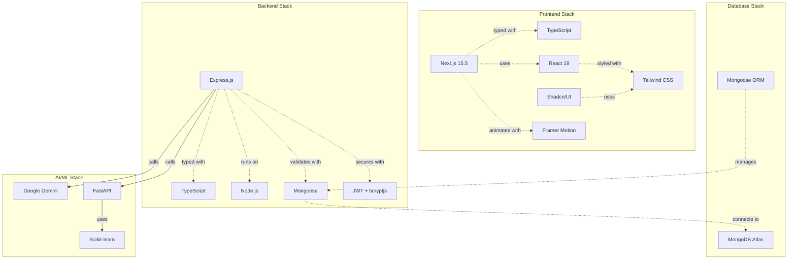

# BeMindful - Architecture Diagram (Mermaid)

## Complete System Architecture



---

## Data Flow Diagram - User Authentication



---

## Data Flow Diagram - Mood Tracking & Recommendations



---

## Data Flow Diagram - AI Chat Conversation



---

## Component Interaction Diagram



---

## Data Model Relationships

```mermaid
erDiagram
    USER ||--o{ CHATSESSION : creates
    USER ||--o{ MOOD : logs
    USER ||--o{ ACTIVITY : performs
    USER ||--o{ TODO : manages
    USER ||--o{ DAILYCHECKIN : completes
    USER ||--|| BASELINESURVEY : completes
    USER ||--o{ SESSION : has

    USER {
        ObjectId _id PK
        string name
        string email UK
        string password
        timestamp createdAt
    }

    CHATSESSION {
        ObjectId _id PK
        ObjectId userId FK
        Message[] messages
        Object metadata
        timestamp createdAt
    }

    MOOD {
        ObjectId _id PK
        ObjectId userId FK
        number score 0-100
        string moodType
        string note
        date timestamp
        timestamp createdAt
    }

    ACTIVITY {
        ObjectId _id PK
        ObjectId userId FK
        string type
        string name
        string description
        number duration
        date timestamp
        timestamp createdAt
    }

    TODO {
        ObjectId _id PK
        ObjectId userId FK
        string title
        boolean isCompleted
        string source
        timestamp createdAt
    }

    DAILYCHECKIN {
        ObjectId _id PK
        ObjectId userId FK
        Object answers
        number score 0-1
        string label
        timestamp createdAt
    }

    BASELINESURVEY {
        ObjectId _id PK
        ObjectId userId FK
        Object answers
        number score 0-1
        timestamp createdAt
    }

    SESSION {
        ObjectId _id PK
        ObjectId userId FK
        string token UK
        date expiresAt
        string deviceInfo
        timestamp createdAt
    }
```

---

## Deployment Architecture



---

## API Endpoint Tree

```mermaid
graph TD
    API["🔌 API Gateway<br/>http://localhost:3001"]
    
    API -->|POST| AUTH_REG["/api/auth/register"]
    API -->|POST| AUTH_LOG["/api/auth/login"]
    API -->|POST| AUTH_OUT["/api/auth/logout"]
    API -->|GET| AUTH_ME["/api/auth/me"]
    
    API -->|GET| MOOD_HIST["/api/mood/"]
    API -->|GET| MOOD_REC["/api/mood/recommendations/latest"]
    
    API -->|POST| CHAT_SESS["/api/chat/sessions"]
    API -->|GET| CHAT_LIST["/api/chat/sessions"]
    API -->|GET| CHAT_HIST["/api/chat/sessions/:id/history"]
    API -->|POST| CHAT_MSG["/api/chat/sessions/:id/messages"]
    API -->|DELETE| CHAT_DEL["/api/chat/sessions/:id"]
    
    API -->|GET| ACT_GET["/api/activity/"]
    API -->|POST| ACT_POST["/api/activity/"]
    
    API -->|GET| TODO_GET["/api/todo/"]
    API -->|POST| TODO_POST["/api/todo/"]
    API -->|PATCH| TODO_UPD["/api/todo/:id"]
    API -->|DELETE| TODO_DEL["/api/todo/:id"]
    
    API -->|GET| STR_GET["/api/stress/"]
    API -->|POST| STR_POST["/api/stress/"]
    
    API -->|WEBHOOK| INNGEST["/api/inngest"]

    style AUTH_REG fill:#e3f2fd
    style AUTH_LOG fill:#e3f2fd
    style AUTH_OUT fill:#e3f2fd
    style AUTH_ME fill:#e3f2fd
    
    style MOOD_HIST fill:#f3e5f5
    style MOOD_REC fill:#f3e5f5
    
    style CHAT_SESS fill:#fff3e0
    style CHAT_LIST fill:#fff3e0
    style CHAT_HIST fill:#fff3e0
    style CHAT_MSG fill:#fff3e0
    style CHAT_DEL fill:#fff3e0
```



---

## Technology Stack Overview



